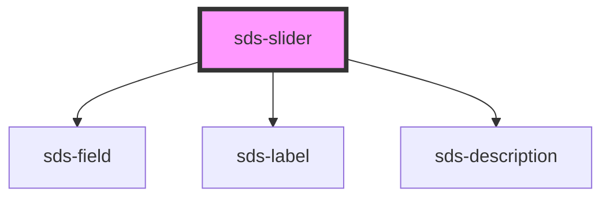

# sds-slider

<!-- Auto Generated Below -->

## Properties

| Property       | Attribute       | Description                                 | Type      | Default |
| -------------- | --------------- | ------------------------------------------- | --------- | ------- |
| `defaultValue` | `default-value` | Initial value for the slider                | `number`  | `0`     |
| `description`  | `description`   | Secondary description label below the input | `string`  | `''`    |
| `disabled`     | `disabled`      | Disables the input                          | `boolean` | `false` |
| `label`        | `label`         | Label for the slider input                  | `string`  | `''`    |
| `name`         | `name`          | The name of the slider                      | `string`  | `''`    |
| `showOutput`   | `show-output`   | Shows or Hides the current value            | `boolean` | `true`  |

## Events

| Event        | Description                             | Type                              |
| ------------ | --------------------------------------- | --------------------------------- |
| `sds-change` | Emitted when the input value is changed | `CustomEvent<{ value: number; }>` |
| `sds-input`  | Emitted when input is detected          | `CustomEvent<{ value: number; }>` |

## Dependencies

### Depends on

- [sds-field](../fieldset/sds-field)
- [sds-label](../fieldset/sds-label)
- [sds-description](../fieldset/sds-description)

### Graph

---

_Built with [StencilJS](https://stenciljs.com/)_
