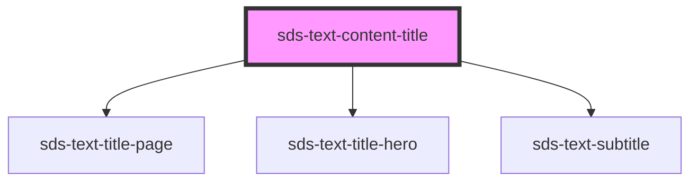

# sds-text-content-title

<!-- Auto Generated Below -->

## Properties

| Property     | Attribute     | Description    | Type                  | Default     |
| ------------ | ------------- | -------------- | --------------------- | ----------- |
| `align`      | `align`       | Align position | `"center" \| "start"` | `'start'`   |
| `heading`    | `heading`     | Heading        | `string`              | `''`        |
| `subHeading` | `sub-heading` | Sub Heading    | `string \| undefined` | `undefined` |

## Dependencies

### Depends on

- [sds-text-title-page](../sds-text-title-page)
- [sds-text-title-hero](../sds-text-title-hero)
- [sds-text-subtitle](../sds-text-subtitle)

### Graph

---

_Built with [StencilJS](https://stenciljs.com/)_
