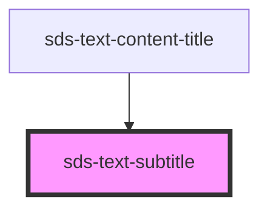

# sds-text-subtitle

<!-- Auto Generated Below -->

## Properties

| Property      | Attribute      | Description  | Type                                                                                   | Default |
| ------------- | -------------- | ------------ | -------------------------------------------------------------------------------------- | ------- |
| `elementType` | `element-type` | Element type | `"h1" \| "h2" \| "h3" \| "h4" \| "h5" \| "h6" \| "p" \| "small" \| "span" \| "strong"` | `'p'`   |

## Dependencies

### Used by

- [sds-text-content-title](../sds-text-content-title)

### Graph

---

_Built with [StencilJS](https://stenciljs.com/)_
