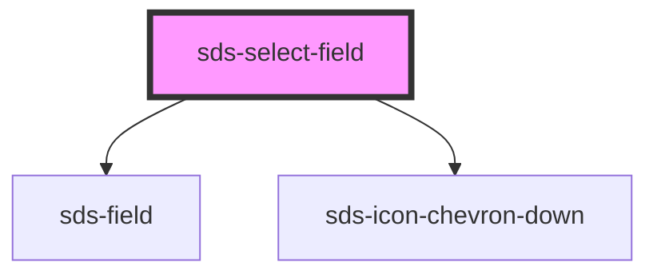

# sds-select-field

<!-- Auto Generated Below -->

## Overview

Select Field

## Properties

| Property      | Attribute     | Description                                   | Type      | Default |
| ------------- | ------------- | --------------------------------------------- | --------- | ------- |
| `description` | `description` | A secondary label below the input             | `string`  | `''`    |
| `disabled`    | `disabled`    | Disables the input                            | `boolean` | `false` |
| `error`       | `error`       | An error message that appears below the input | `string`  | `''`    |
| `label`       | `label`       | The input label                               | `string`  | `''`    |
| `placeholder` | `placeholder` | Placeholder text for the input                | `string`  | `''`    |

## Dependencies

### Depends on

- [sds-field](../../fieldset/sds-field)
- [sds-icon-chevron-down](../../../icons)

### Graph

---

_Built with [StencilJS](https://stenciljs.com/)_
