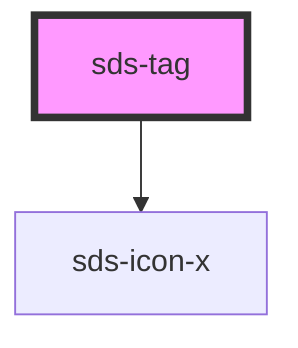

# sds-tag

<!-- Auto Generated Below -->

## Properties

| Property    | Attribute   | Description                                   | Type                                                          | Default     |
| ----------- | ----------- | --------------------------------------------- | ------------------------------------------------------------- | ----------- |
| `removable` | `removable` | Show or hide the x button                     | `boolean`                                                     | `false`     |
| `scheme`    | `scheme`    | Color scheme for the tag                      | `"brand" \| "danger" \| "neutral" \| "positive" \| "warning"` | `'brand'`   |
| `variant`   | `variant`   | Sets which set of colors to use in the scheme | `"primary" \| "secondary"`                                    | `'primary'` |

## Events

| Event     | Description                               | Type                |
| --------- | ----------------------------------------- | ------------------- |
| `removed` | Fires when the `x` icon button is clicked | `CustomEvent<null>` |

## Dependencies

### Depends on

- [sds-icon-x](../../../icons)

### Graph

----------------------------------------------

*Built with [StencilJS](https://stenciljs.com/)*
